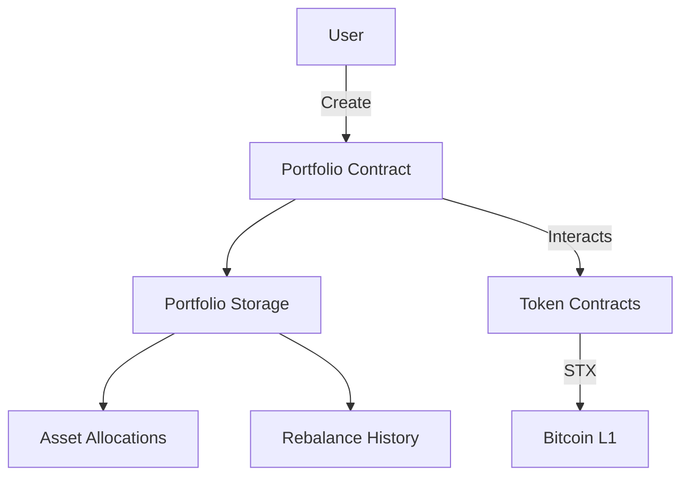

# BitStack Rebalancer

**A Bitcoin-native portfolio management and automated rebalancing protocol built on Stacks.**

## Overview

**BitStack Rebalancer** is a smart contract designed to bring decentralized, automated portfolio management to Bitcoin holders through the **Stacks Layer 2** infrastructure. The protocol enables users to:

* Create custom crypto portfolios
* Define target asset allocations
* Automatically rebalance portfolios to maintain desired allocations over time

By operating on Stacks, BitStack Rebalancer inherits the security and finality of Bitcoin while supporting a programmable and decentralized approach to asset management.

## Features

* 🧾 **Portfolio Creation**: Users can create portfolios with up to 10 different crypto assets, specifying target allocation percentages.
* ♻️ **Automated Rebalancing**: Periodic rebalancing keeps the portfolio aligned with its target allocation.
* 🔒 **Bitcoin-Native Security**: Built on Stacks, settled and secured by Bitcoin.
* 👥 **Multi-Portfolio Support**: Users can manage multiple portfolios concurrently.
* 🛠️ **Permissioned Allocation Updates**: Portfolio owners can adjust asset targets at any time.

## Contract Architecture

### Key Components

* **Portfolios**: A map storing metadata and ownership details for each portfolio.
* **PortfolioAssets**: Tracks target allocations and current balances per asset.
* **UserPortfolios**: Keeps a list of portfolio IDs for each user.

### Access Control

* Only portfolio owners can rebalance or modify allocations.
* Only the protocol owner can transfer ownership of the protocol.

## Installation & Development

Make sure you're using the latest version of [Clarinet](https://docs.hiro.so/clarity/clarinet) for local development and testing.

### 1. Clone the Repo

```bash
git clone https://github.com/your-org/bitstack-rebalancer.git
cd bitstack-rebalancer
```

### 2. Run Tests

```bash
clarinet test
```

### 3. Check Contract Syntax

```bash
clarinet check
```

### 4. Interact via Console

```bash
clarinet console
```

## Core Functions

| Function                      | Access    | Description                                                       |
| ----------------------------- | --------- | ----------------------------------------------------------------- |
| `create-portfolio`            | Public    | Initialize a new portfolio with token list and target allocations |
| `rebalance-portfolio`         | Public    | Trigger a portfolio rebalance if conditions are met               |
| `update-portfolio-allocation` | Public    | Adjust target allocation for a specific token                     |
| `get-portfolio`               | Read-only | Fetch metadata for a portfolio                                    |
| `get-user-portfolios`         | Read-only | Return all portfolio IDs owned by a user                          |
| `calculate-rebalance-amounts` | Read-only | Check if a portfolio needs rebalancing                            |

## Error Handling

| Code   | Meaning                  |
| ------ | ------------------------ |
| `u100` | Not authorized           |
| `u101` | Invalid portfolio        |
| `u102` | Insufficient balance     |
| `u103` | Invalid token            |
| `u104` | Rebalance failed         |
| `u105` | Portfolio already exists |
| `u106` | Invalid percentage       |
| `u107` | Max token limit exceeded |
| `u108` | Length mismatch          |
| `u109` | User storage failed      |
| `u110` | Invalid token ID         |

## Admin Function

| Function     | Description                                                          |
| ------------ | -------------------------------------------------------------------- |
| `initialize` | Transfer protocol ownership to a new principal (not self-assignable) |

## Rebalancing Logic

* Rebalancing eligibility is time-based.
* Portfolios can be rebalanced once every **144 blocks** (\~24 hours).
* This logic is verified through the `calculate-rebalance-amounts` read-only function.

## Architecture



## Contributing

1. Fork repository
2. Create feature branch (`git checkout -b feature/amazing`)
3. Commit changes (`git commit -m 'Add amazing feature'`)
4. Push to branch (`git push origin feature/amazing`)
5. Open Pull Request
